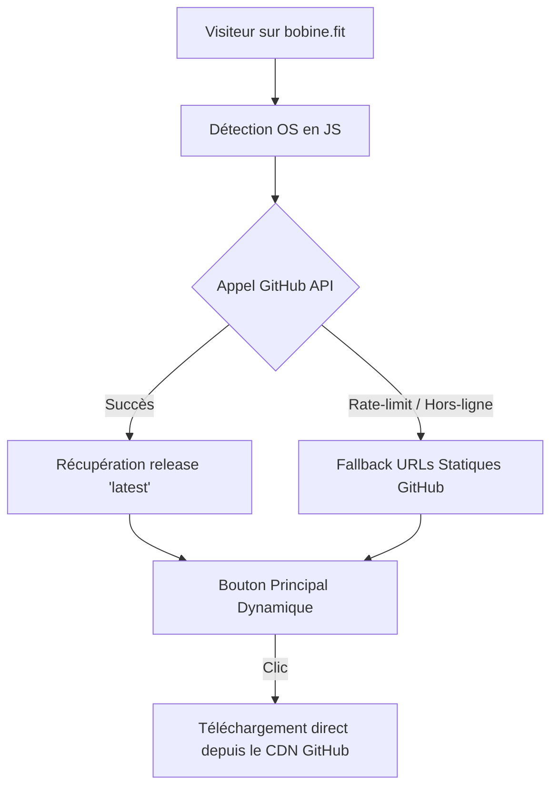

# Notes de version & Correctifs (patch.md)

Ce document consigne les évolutions, correctifs et améliorations UI/UX apportés à **Bobine**, dans la continuité des spécifications techniques du projet.

---

## 1. Stabilisation de l'affichage TV & Kiosk (`/kiosk`, `/cinema`)

### Problème résolu
- Sur les écrans TV et moniteurs à ratios non standards ou carrés (tels que 1600×1200, 4:3, 16:10), l'écran d'attente présentait des éléments étirés, distordus ou dispersés aux extrémités de l'écran en raison d'un ancien positionnement par pourcentages absolus hérité du moteur Canvas.
- Le logo et les textes de l'écran d'attente ne s'adaptaient pas harmonieusement aux dimensions réelles de la zone visible.

### Modifications techniques
- **Layout centré et fluide (`frontend/src/app/kiosk/page.tsx`)** :
  - Remplacement de la structure `kiosk-waiting-stage` et de ses cellules à coordonnées absolues par un conteneur Flexbox centré `kiosk-waiting-content`.
  - Hiérarchie verticale épurée : horloge grand format, logo central, prochain cours et compte à rebours.
- **Règles CSS adaptatives (`frontend/src/app/globals.css`)** :
  - Utilisation d'unités `vmin` et de fonctions `clamp()` pour l'horloge (`clamp(3.5rem, 8.5vmin, 7.5rem)`), le logo et les libellés.
  - Encadrement strict du logo (`.kiosk-waiting-stage-logo`) avec `object-fit: contain`, `max-height: clamp(80px, 20vmin, 180px)` et `max-width: min(65vw, 680px)`.
  - Maintien du ratio d'aspect originel du logo sans aucune déformation ni distorsion, quelle que soit la résolution du téléviseur ou du diffuseur vidéo.

---

## 2. Image de marque & Gestion du logo personnalisé (`/settings`)

### Problème résolu
- Dans la page Paramètres, la vignette de prévisualisation du logo débordait de sa boîte carrée de 72×72 px lorsque le logo était large.
- L'import d'un logo écrasait immédiatement l'affichage, sans permettre de basculer manuellement entre le logo officiel Bobine et le logo personnalisé sans supprimer ce dernier.

### Modifications techniques
- **Backend (`backend/app/routers/settings.py`)** :
  - Ajout du réglage `active_logo` (`"default"` ou `"custom"`) persisté en base de données SQLite (table `settings`).
  - Validation stricte dans `update_settings` : interdiction d'activer `"custom"` si aucun fichier logo personnalisé n'est présent sur le serveur.
  - Lors d'un téléversement (`POST /api/settings/logo`), le logo personnalisé est enregistré et immédiatement défini comme actif (`active_logo = "custom"`).
  - Lors d'une suppression (`DELETE /api/settings/logo`), le fichier est purgé du disque et le réglage repasse sur `"default"`.
  - Diffusion temps réel via WebSocket (`settings_change`) incluant `has_custom_logo` et `active_logo`.
- **Composant Logo (`frontend/src/components/AppLogo.tsx`)** :
  - Consommation de `activeLogo` : affichage du logo customisé uniquement si `activeLogo === "custom"` ET `hasCustomLogo === true`.
  - Protection CSS inline et par classe (`max-width: 100%`, `max-height: 100%`, `object-fit: contain`) pour garantir le confinement parfait dans tout conteneur parent.
- **Contexte d'application (`frontend/src/lib/AppSettingsContext.tsx`)** :
  - Exposition de `activeLogo` et de la méthode `setActiveLogo(choice)`.
  - Synchronisation instantanée locale et persistée vers l'API.
- **Interface Paramètres (`frontend/src/app/settings/page.tsx`)** :
  - Cadre de prévisualisation dimensionné (180×84 px) avec padding interne et fond surélevé (`--bg-surface-elevated`).
  - Ajout d'un sélecteur interactif segmenté (Boutons *Logo Bobine* / *Logo personnalisé*) dès qu'un logo est importé.
  - Bouton de remplacement du logo et bouton de suppression définitive avec confirmation modale.
  - Remplacement de la simple case à cocher par un bouton toggle segmenté explicite **Oui / Non** pour l'animation vidéo de lancement mp4 (`Lancement.mp4`) avant les cours en canal Câblé.

---

## 3. Harmonisation UI/UX du Design System & Nouveaux Thèmes

### Problème résolu
- Les thèmes existants présentaient des contrastes bruts (fonds vifs saturés, décalages de luminance entre surfaces).
- Manque de thèmes clairs chaleureux et équilibrés pour les salles de sport et studios lumineux.

### Modifications techniques
- **Harmonisation des thèmes existants (`frontend/src/app/globals.css`)** :
  - Vérification et renforcement des contrastes typographiques (respect des critères WCAG AA/AAA).
  - Adoucissement des fonds clairs (remplacement des aplats fluo par des teintes pastel feutrées pour `menthe`, `ciel`, `lavande`).
  - Enrichissement des fonds sombres (`lune`, `automne`, `hiver`, `chili`, `orchidee`, `taupe`, `charbon`) avec des élévations de surface subtiles et des bordures nettes.
- **Création de deux nouveaux thèmes clairs** :
  1. **Miel (`miel`)** :
     - Ambiance chaleureuse, dorée et lumineuse.
     - Fond crème ambré (`#fdfbf5`), surfaces blanches et ivoire (`#ffffff`, `#fef7e7`), typographie brun chaud (`#2b1d0c`, `#785723`), accent ambre doré (`#d97706`).
  2. **Coco (`coco`)** :
     - Ambiance naturelle inspirée de la noix de coco (lait de coco, crème douce et marron chocolat).
     - Fond blanc cassé velouté (`#faf7f4`), surfaces crème douce (`#ffffff`, `#f4ece5`), typographie chocolat torréfié (`#2a1c14`, `#6b4d3b`), accent bois noble / chocolat chaud (`#78350f`).
- **Enregistrement et internationalisation** :
  - Ajout des clés dans `_VALID_THEMES` (`backend/app/routers/settings.py`).
  - Ajout dans `Theme` et `THEME_VALUES` (`frontend/src/lib/AppSettingsContext.tsx`).
  - Traductions FR / EN dans `frontend/src/lib/i18n.ts`.
  - Pastilles de prévisualisation coordonnées dans `THEME_SWATCHES` (`frontend/src/app/settings/page.tsx`).
- **Classification des thèmes en deux catégories distinctes (`frontend/src/app/settings/page.tsx`)** :
  - Séparation visuelle nette dans les Paramètres entre **Thèmes clairs** (`clair`, `miel`, `coco`, `menthe`, `ciel`, `beige`, `lavande`) et **Thèmes sombres** (`les-mills-sombre`, `lune`, `automne`, `hiver`, `chili`, `orchidee`, `taupe`, `charbon`), avec en-têtes et icônes thématiques.
- **Thématisation dynamique des encadrés d'état sur l'écran principal (`frontend/src/app/globals.css`, `DashboardScreen.tsx`)** :
  - Remplacement des teintes vertes hardcodées par les variables du thème (`var(--accent-primary)`, `var(--bg-surface-elevated)`).
  - Les encadrés "En attente" (`.status-pill.waiting`), "Voir le planning" (`a.status-pill`) et les statuts système s'adaptent désormais instantanément au thème actif (doré en Miel, chocolat chaud en Coco, indigo en Lune, rouge Les Mills en Sombre/Clair, sauge en Menthe, etc.).

---

## 4. Documentation & Référencement (`README.md`, `README.fr.md`)

- Repositionnement discret des listes de mots-clés SEO en fin de document (section pied de page) pour préserver la lisibilité humaine et l'élégance de la présentation tout en maintenant l'indexation.

---

## 5. Suivi des Releases & Découplage des Paramètres de Transition

### Modifications techniques
- **Découplage des sections de configuration (`frontend/src/app/settings/page.tsx`)** :
  - Séparation nette entre la section **Animation de lancement** (vidéo `Lancement.mp4` pour canal Câblé avec commutateur Oui / Non) et la section **Durées de transition & Mode Coach** (durée d'attente entre cours de playlist, minuteur enchaînement coach, fondu des rappels radio et volume).
- **Module de suivi des mises à jour (`backend/app/routers/updates.py`, `backend/app/main.py`)** :
  - Endpoint `GET /api/updates/check` : compare la version locale Git / tag (`git describe`, `git rev-parse`) avec la dernière release officielle de `FantasmaGlad/Bobine` via l'API GitHub.
  - Tolérance réseau complète : en mode hors-ligne ou sans connexion Internet, la réponse est traitée de manière gracieuse sans blocage ni erreur serveur.
  - Endpoint `POST /api/updates/apply` : déclenche la mise à jour asynchrone et la relance des services.
- **Interface & Animation professionnelle (`frontend/src/app/settings/page.tsx`, `frontend/src/app/globals.css`)** :
  - Bouton interactif « Rechercher une mise à jour » avec animation de rotation fluide (`.olc-spin`).
  - Affichage de la version actuelle et du commit actif.
  - Badge « Système à jour » ou notification détaillée avec notes de version dépliables et bouton d'installation directe.

---

## 6. Mission PortabiliteCrossPlatformX — Lot 0 : suppression de Redis, backend mono-processus

### Contexte
Premier lot d'un chantier de portabilité multi-OS (Windows, Linux de bureau, macOS) détaillé dans [`docs/cahier-des-charges-multi-os.md`](docs/cahier-des-charges-multi-os.md) et [`docs/plan-implementation-portabilite-crossplatformx.md`](docs/plan-implementation-portabilite-crossplatformx.md). Ce lot est un préalable architectural bloquant pour les lots suivants (voir ces documents pour le détail complet).

### Impact site web / releases
- **Aucun impact utilisateur ni sur le site bobine.fit** : changement d'architecture interne, aucune fonctionnalité visible n'est ajoutée ou retirée.
- **À mentionner dans les notes de la prochaine release GitHub** : suppression de la dépendance à Redis (utile pour quiconque aurait scripté une supervision externe autour de `redis-server` sur son installation).

### Modifications techniques (résumé — détail dans le CDC §4)
- Backend passé de 4 workers `uvicorn` à 1 seul (`install.sh`, `bobine-backend.service`) : l'état de lecture (câblé/réseau/radio), les verrous de tick et de planning, la file d'import et le bail « kiosque primaire » vivent désormais entièrement en mémoire d'un seul processus, sans bus d'état externe.
- Suppression complète de la dépendance `redis` (`backend/requirements.txt`, `install.sh`, `scripts/watchdog.sh`).
- `backend/app/utils/redis_client.py` et `tick_lock.py` supprimés ; `boot_state.py` simplifié (identifiant de démarrage local au processus, sans lecture `/proc`).
- `GET /api/health` ne rapporte plus de composant « redis ».
- Aucune migration de données : Redis ne portait que de l'état transitoire, jamais de données persistantes (SQLite reste l'unique stockage).
- Documentation corrigée en conséquence : `README.md`/`README.fr.md`, `docs/ARCHITECTURE.md`, `docs/cahier-des-charges-radio.md`, contexte des agents IA (`.agents/`, `.gemini/`).

---

## 7. Mission PortabiliteCrossPlatformX — Lot 1 : application de bureau Windows native (`.exe`)

### Contexte
Deuxième lot du chantier de portabilité multi-OS, priorité n°1 du CDC : Bobine s'installe désormais aussi comme une application de bureau Windows classique (PC ou mini PC Windows 10/11/IoT), en plus de l'appliance headless Debian existante. Détail complet dans [`docs/cahier-des-charges-multi-os.md`](docs/cahier-des-charges-multi-os.md) et [`docs/plan-implementation-portabilite-crossplatformx.md`](docs/plan-implementation-portabilite-crossplatformx.md) §2.

### Impact site web / releases
- **Nouveau livrable de release GitHub** : chaque release doit désormais joindre `Bobine-Setup-<version>.exe` (produit par le job CI `windows-build`), en plus des artefacts existants.
- **À mentionner dans les notes de release** : premier support Windows natif ; avertissement SmartScreen « éditeur non reconnu » à documenter comme limitation connue (pas de signature de code pour l'instant, CDC décision #7).
- Nouvelle section README (FR/EN) « Installer sur Windows » — à référencer depuis le site bobine.fit une fois celui-ci mis à jour.

### Modifications techniques (résumé — détail dans le plan §2)
- Module partagé `backend/app/utils/deployment.py` + `backend/app/utils/deployment_profiles/` : détection de profil (`linux-headless`/`windows`, `linux-desktop`/`macos` réservés aux lots suivants) et abstraction `ProfileHandler` pour éviter toute collision future sur `settings.py`/`updates.py`/le frontend.
- `backend/app/desktop/tray.py` : icône de zone de notification (`pystray`), supervision du process `BobineBackend` (relance sur mort ou échec répété de `/api/health`), lancement du mode kiosque optionnel (Edge `--kiosk` ou navigateur par défaut).
- `backend/app/utils/mdns.py` : le backend publie lui-même `bobine.local` (`zeroconf`), remplace l'annonce Avahi de l'appliance headless.
- `backend/app/config.py` : données applicatives sous `%ProgramData%\Bobine` (et non `%ProgramFiles%`, non inscriptible sans élévation) ; chemins et exécutable figé (`sys.frozen`) résolus dynamiquement.
- Endpoints de réinitialisation/désinstallation (`routers/settings.py`) et de mise à jour (`routers/updates.py`) adaptés par profil ; mise à jour Git désactivée sur ce profil (réinstallation du `.exe` à la place) ; page Paramètres du frontend adaptée en conséquence.
- Packaging : `packaging/windows/{bobine.spec,bobine.iss,bobine.ico}` (PyInstaller + Inno Setup, FR/EN, licence AGPL-3.0 affichée, règle de pare-feu automatique pour la télécommande mobile) ; nouveau job CI `windows-build`.
- **Non vérifiable dans cet environnement de développement Linux** : compilation réelle par Inno Setup, exécution du `.exe` sur une vraie machine Windows, avertissement SmartScreen, invite pare-feu, autostart à l'ouverture de session — écrit d'après la documentation officielle, à valider au premier passage du job CI et lors d'un test manuel sur machine Windows réelle avant toute distribution publique (détail dans le plan §2).

---

## 8. Mission PortabiliteCrossPlatformX — Lot 2 : application de bureau Linux native (`.deb`)

### Contexte
Troisième lot du chantier de portabilité multi-OS, deuxième cible grand public : Bobine s'installe désormais comme un paquet Debian standard (`.deb`) pour tout utilisateur disposant d'un environnement de bureau Linux (Debian, Ubuntu, Linux Mint, etc.), tout en conservant intact le profil appliance headless. Détail complet dans [`docs/cahier-des-charges-multi-os.md`](docs/cahier-des-charges-multi-os.md) et [`docs/plan-implementation-portabilite-crossplatformx.md`](docs/plan-implementation-portabilite-crossplatformx.md) §3.

### Impact site web / releases
- **Nouveau livrable de release GitHub** : chaque release joint désormais `bobine_<version>_amd64.deb` (produit par le job CI `linux-desktop-deb`), en plus de l'installeur Windows `.exe`.
- **À mentionner dans les notes de release** : support natif Linux de bureau via paquet `.deb`, intégration XDG pour les données personnelles, lancement automatique et gestion via BobineTray.
- Restructuration des READMEs pour placer la famille d'applications de bureau graphiques en méthode d'installation n°1.

### Modifications techniques (résumé — détail dans le plan §3)
- Handler de profil `LinuxDesktopHandler` (`backend/app/utils/deployment_profiles/linux_desktop.py`) branché dans `backend/app/utils/deployment.py`.
- Chemins conformes à la spécification XDG Base Directory (`backend/app/config.py`) : stockage des données, médias et base de données dans `~/.local/share/bobine/`, et configuration utilisateur dans `~/.config/bobine/config.toml` (le répertoire système `/usr/lib/bobine/` étant en lecture seule root).
- `backend/app/desktop/tray.py` : détection des navigateurs Chromium / Chrome / Firefox pour le lancement en mode `--kiosk` sous Linux, et gestion de l'anti-veille d'écran via `xset` sous X11.
- Packaging Debian complet (`packaging/linux/`) :
  - `bobine.spec` : spec PyInstaller Linux produisant deux exécutables autonomes `BobineBackend` et `BobineTray` sans dépendance de version Python système.
  - `DEBIAN/control` : métadonnées Debian (dépendance `ffmpeg`, recommandation `avahi-daemon`).
  - `DEBIAN/postinst`, `DEBIAN/prerm`, `DEBIAN/postrm` : scripts de maintenance système pour les caches d'icônes et .desktop.
  - `bobine.desktop` : intégration au menu d'applications et autostart de session XDG (`/etc/xdg/autostart`).
  - `bobine.service` : unité systemd utilisateur (`systemctl --user start bobine`).
  - `build_deb.sh` : script automatisé d'assemblage et de compilation `dpkg-deb`.
- Pipeline CI : ajout du job `linux-desktop-deb` dans `.github/workflows/ci.yml` (compilation PyInstaller, génération `.deb`, validation de structure et test d'installation `sudo dpkg -i` sur Ubuntu).

---

## 9. Mission PortabiliteCrossPlatformX — Lot 3 : application de bureau macOS native (`.dmg`)

### Contexte
Quatrième et dernier lot du chantier de portabilité multi-OS : Bobine s'installe désormais aussi comme une application de bureau macOS classique (bundle `.app` glisser-déposer vers `/Applications`), complétant Windows (`.exe`, Lot 1) et Linux de bureau (`.deb`, Lot 2), tout en conservant intact le profil appliance headless. Détail complet dans [`docs/cahier-des-charges-multi-os.md`](docs/cahier-des-charges-multi-os.md) et [`docs/plan-implementation-portabilite-crossplatformx.md`](docs/plan-implementation-portabilite-crossplatformx.md) §4.

### Impact site web / releases
- **Nouveau livrable de release GitHub** : chaque release joint désormais `Bobine-<version>.dmg` (produit par le job CI `macos-build`), en plus de l'installeur Windows `.exe` et du paquet Linux `.deb`.
- **À mentionner dans les notes de release** : premier support macOS natif (Apple Silicon), lancement automatique à la connexion via LaunchAgent, avertissement Gatekeeper « éditeur non identifié » à documenter comme limitation connue (pas de certificat de signature/notarisation pour l'instant, décision #7 du CDC).
- Nouvelle section README (FR/EN) « Installer sur macOS ».

### Modifications techniques (résumé — détail dans le plan §4)
- Handler de profil `MacOSHandler` (`backend/app/utils/deployment_profiles/macos.py`) branché dans `backend/app/utils/deployment.py`.
- Chemins de données par défaut résolus vers `~/Library/Application Support/Bobine` (`backend/app/config.py`), y compris pour le bundle figé où `BUNDLE()` PyInstaller relocalise les `datas` sous `Contents/Resources/` (correctif appliqué aussi dans `backend/app/main.py` pour `frontend/out/`).
- `backend/app/desktop/tray.py` : lancement du navigateur en mode kiosque via `open -na` (bundles `.app`, pas d'exécutable nu sur le PATH) + anti-veille `caffeinate` attachée au PID du navigateur ; **auto-installation du LaunchAgent** (`~/Library/LaunchAgents/com.bobine.app.plist`) au tout premier lancement de `BobineTray`, faute de script `postinstall` disponible sur un `.dmg` glisser-déposer.
- `backend/app/main.py` : correctif de détection du process kiosque (`_kiosk_process_alive`) pour le nom de process macOS de Chrome (« Google Chrome », non détecté auparavant).
- `backend/requirements.txt` : ajout de `pyobjc-core`/`pyobjc-framework-Cocoa`/`pyobjc-framework-Quartz` (marqueur `sys_platform == "darwin"`, sans effet sur Windows/Linux) — `pystray` retenu plutôt que `rumps` après vérification.
- Packaging complet (`packaging/macos/`) :
  - `bobine.spec` : spec PyInstaller macOS produisant `Bobine.app` via `BUNDLE()`.
  - `bobine.icns` : icône multi-résolution générée depuis les assets existants.
  - `build_app.sh` : script automatisé de compilation, signature ad-hoc et génération du `.dmg` via `hdiutil`.
- Pipeline CI : ajout du job `macos-build` dans `.github/workflows/ci.yml` (compilation PyInstaller, **signature ad-hoc obligatoire sur les runners Apple Silicon**, vérification `/api/health`, génération `.dmg`, publication de l'artefact).
- **Non vérifiable dans cet environnement de développement Linux** : compilation réelle par `BUNDLE()`, exécution du `.app` sur une vraie machine macOS, avertissement Gatekeeper, comportement réel de `caffeinate`/`open -na`/LaunchAgent — écrit d'après une recherche documentaire dédiée (PyInstaller, Apple Developer, pystray), à valider au premier passage du job CI et lors d'un test manuel sur Mac réel avant toute distribution publique (détail dans le plan §4).

---

## 10. Mission PortabiliteCrossPlatformX — Harmonisation des icônes natives et raccourcis Bureau (Windows, Linux, macOS)

### Contexte
Garantit que chaque utilisateur, quelle que soit sa plateforme de bureau (Windows, Linux, macOS), dispose d'une icône de projet nette, fidèle à son ratio d'aspect, au format natif exigé par son système d'exploitation, ainsi que d'un raccourci d'application placé directement sur son Bureau dès l'installation.

### Modifications techniques
- **Générateur d'icônes automatisé (`scripts/generate_platform_icons.py`)** :
  - Prend l'icône source `Assets/Images/logo_bobine_icon.png` (629×700), cadre le logo au centre d'un canevas carré transparent 1024×1024 sans déformation de ratio d'aspect (rééchantillonnage Lanczos).
  - Génère automatiquement :
    - **Windows** : `packaging/windows/bobine.ico` au format multi-résolution (16×16, 24×24, 32×32, 48×48, 64×64, 128×128, 256×256) pour un affichage net sur la barre des tâches, le bureau et dans l'explorateur.
    - **macOS** : `packaging/macos/bobine.icns` avec la table des matières Apple (`TOC`, `ic07` à `ic14`, `ic10` 1024×1024 Retina).
    - **Linux** : arborescence complète Freedesktop hicolor `packaging/linux/icons/hicolor/{16,24,32,48,64,128,256,512}x{...}/apps/bobine.png` et `packaging/linux/icons/pixmaps/bobine.png`.
- **Raccourcis Bureau lors des installations** :
  - **Windows (`packaging/windows/bobine.iss`)** : ajout de la tâche `[Tasks] Name: "desktopicon"` et du raccourci `[Icons] Name: "{autodesktop}\{#MyAppName}"` pointant sur `BobineTray.exe`. L'installeur propose la création du raccourci sur le Bureau (coché par défaut).
  - **Linux (`packaging/linux/DEBIAN/postinst` & `packaging/linux/build_deb.sh`)** : le paquet Debian déploie toutes les résolutions hicolor et pixmaps ; le script `postinst` détecte le dossier `Desktop` ou `Bureau` de l'utilisateur connecté (`$SUDO_USER`) et y copie `bobine.desktop` avec permissions exécutables (`chmod 0755`) et marqueur de confiance GNOME (`gio set metadata::trusted true`). Nettoyage propre au `postrm`.
  - **macOS (`backend/app/desktop/tray.py` & `packaging/macos/bobine.spec`)** : `bobine.icns` explicitement déclaré dans `CFBundleIconFile` d'`info_plist` ; `BobineTray` vérifie et crée au premier lancement un alias/symlink `Bobine.app` sur le Bureau (`~/Desktop/Bobine.app`) si le dossier existe.
- **Rendu Systray (`backend/app/desktop/tray.py`)** : fonction `_load_icon_image()` améliorée pour recadrer en carré transparent avant redimensionnement en 64×64, évitant tout étirement de l'icône dans la zone de notification.

---

## 11. Mission PortabiliteCrossPlatformX — Chantier Transverse A & Guide de Distribution Web (`bobine.fit`)

### Contexte & Objectifs
Dans le cadre de la portabilité multi-OS complète de Bobine (appliance Debian headless, application Windows `.exe`, application Linux de bureau `.deb`, application macOS `.dmg`), les opérations d'administration système ne pouvaient plus présumer de la présence exclusive de `systemctl`, ni dépendre uniquement de commandes `git pull` pour les mises à jour.

Le **Chantier Transverse A** unifie ces opérations au travers d'une architecture extensible de profils de déploiement (`ProfileHandler`), intègre la sauvegarde/restauration universelle de configuration et de données, et assure une gestion des mises à jour adaptée à chaque OS. En parallèle, cette section fournit le **guide technique complet pour distribuer automatiquement ces installeurs sur le site vitrine officiel `bobine.fit`**.

---

### Partie 1 : Modifications techniques (Chantier Transverse A)

#### 1. Architecture par Profils (`backend/app/utils/deployment.py`)
- Définition du protocole `ProfileHandler` et du registre `PROFILE_HANDLERS` pour les 4 profils de déploiement :
  - `linux-headless` : Appliance dédiée Wyse / mini PC sous Debian 13 (gestion par systemd, mise à jour par git).
  - `windows` : Application de bureau Windows 10/11 installée par Inno Setup (`.exe`).
  - `linux-desktop` : Application de bureau pour distributions Debian/Ubuntu/Mint installée par paquet `.deb`.
  - `macos` : Application de bureau Apple Silicon installée par `.dmg` / `Bobine.app`.
- Exposition du profil courant dans `GET /api/settings` (`deployment_profile`) pour adapter dynamiquement l'interface d'administration.

#### 2. Mises à jour intelligentes selon le profil (`backend/app/routers/updates.py`)
- **Appliance Headless (`linux-headless`)** : Mise à jour automatique in-place via Git (`git rev-parse`, `git describe`, `git pull`) et redémarrage supervisé de `bobine-backend` et `bobine-kiosk`. `can_auto_apply = True`.
- **Profils Desktop (`windows`, `linux-desktop`, `macos`)** :
  - Détection sémantique de version via l'API GitHub Releases (`FantasmaGlad/Bobine`).
  - Extraction automatique de l'actif installateur correspondant :
    - Windows : `.exe` (`Bobine-Setup-<version>.exe`)
    - Linux Desktop : `.deb` (`bobine_<version>_amd64.deb`)
    - macOS : `.dmg` (`Bobine-<version>.dmg`)
  - Fourniture du lien direct de téléchargement (`download_url`), du nom de l'actif (`asset_name`), de sa taille en octets (`asset_size`), et du drapeau `can_auto_apply = False`.
  - Dans la page Paramètres (`frontend/src/app/settings/page.tsx`), remplacement du bouton "Appliquer la mise à jour" par un bouton d'action directe "Télécharger l'installateur ({asset_name})".

#### 3. Sauvegarde & Restauration Universelles (`backend/app/routers/settings.py`)
- **Exportation (`GET /api/settings/backup/export`)** :
  - Exécute `PRAGMA wal_checkpoint(TRUNCATE)` sur SQLite pour vider les journaux WAL dans la base principale.
  - Archive dans un fichier ZIP téléchargeable :
    - `database.db` : base SQLite complète (cours, plannings, playlists, réglages).
    - `config.toml` : configuration locale si personnalisée.
    - `manifest.json` : métadonnées d'export (version, horodatage UTC, profil source, signature).
- **Restauration (`POST /api/settings/backup/restore`)** :
  - Réception du fichier ZIP via l'interface d'administration.
  - Vérification de l'intégrité de l'archive et de l'en-tête binaire SQLite (`SQLite format 3\x00`).
  - Sauvegarde de secours automatique de la base active (`database.db.bak`).
  - Remplacement atomique de la base et de la configuration, puis redémarrage automatique des services.

#### 4. Remise à zéro d'usine des données (`POST /api/settings/system/reset-data`)
- Permet de réinitialiser entièrement les données applicatives (vidéos, musiques radio/cours, base de données SQLite) sans JAMAIS altérer les binaires applicatifs installés sur le système (`/usr/lib/bobine`, `Program Files`, `/Applications`).
- Sécurité renforcée : confirmation modale exigeant la saisie explicite du mot « REINITIALISER ». Accessible sur l'ensemble des 4 profils de déploiement.

---

### Partie 2 : Guide d'Implémentation pour la Distribution Web (`bobine.fit`)

Le site web vitrine `bobine.fit` doit permettre à tout visiteur de télécharger en 1 clic l'installateur graphique adapté à son système d'exploitation, tout en offrant un accès clair aux autres plateformes et à la méthode appliance.

#### 1. Architecture & Stratégie de Téléchargement



- **Hébergement des binaires** : Les installeurs sont hébergés gratuitement et sans limite de bande passante sur le **CDN de GitHub Releases**. Le serveur de `bobine.fit` ne sert que les pages web statiques/légères.
- **Mise à jour sans redéploiement** : Dès qu'une nouvelle version est publiée sur GitHub (ex: `v1.2.0`), le site web propose instantanément la nouvelle version sans aucune modification manuelle de son code.

#### 2. Matrice de Correspondance Plateforme / Livrable

| Système détecté | Fichier de destination | Format d'artefact GitHub | Action proposée sur `bobine.fit` |
|---|---|---|---|
| **Windows** (10, 11) | `Bobine-Setup-<version>.exe` | `.exe` | Téléchargement direct + note SmartScreen |
| **macOS** (Apple Silicon) | `Bobine-<version>.dmg` | `.dmg` | Téléchargement direct + note Gatekeeper |
| **Linux Bureau** (Debian, Ubuntu, Mint...) | `bobine_<version>_amd64.deb` | `.deb` | Téléchargement direct ou commande `apt install` |
| **Appliance mini PC** (Debian 13 dédié) | Script d'installation | `install.sh` | Bloc de commande 1-ligne à copier/coller |

#### 3. Logique de Détection OS côté Client (JavaScript / TypeScript)

Ce code s'intègre facilement dans n'importe quelle stack frontend (React, Vue, Next.js, HTML/JS vanilla) :

```javascript
/**
 * Détecte l'OS du visiteur avec prise en charge de User-Agent Client Hints.
 * @returns {'windows' | 'macos' | 'linux' | 'unknown'}
 */
export function detectVisitorOS() {
  if (typeof window === 'undefined') return 'unknown';

  // 1. Détection moderne via User-Agent Data API si disponible
  const platform = navigator.userAgentData?.platform?.toLowerCase() || '';
  if (platform.includes('win')) return 'windows';
  if (platform.includes('mac')) return 'macos';
  if (platform.includes('linux')) return 'linux';

  // 2. Détection classique par chaîne User-Agent
  const ua = navigator.userAgent.toLowerCase();
  if (ua.includes('win')) return 'windows';
  if (ua.includes('mac') && !ua.includes('iphone') && !ua.includes('ipad')) return 'macos';
  if (ua.includes('linux') && !ua.includes('android')) return 'linux';

  return 'unknown';
}
```

#### 4. Intégration de l'API GitHub Releases avec Fallback Robuste

```javascript
const REPO = 'FantasmaGlad/Bobine';
const GITHUB_API_URL = `https://api.github.com/repos/${REPO}/releases/latest`;

// URLs statiques de repli (utilisées si l'API GitHub est rate-limitée)
const FALLBACK_URLS = {
  windows: `https://github.com/${REPO}/releases/latest/download/Bobine-Setup-latest.exe`,
  macos: `https://github.com/${REPO}/releases/latest/download/Bobine-latest.dmg`,
  linux: `https://github.com/${REPO}/releases/latest/download/bobine_latest_amd64.deb`,
};

export async function fetchLatestReleaseAssets() {
  try {
    const res = await fetch(GITHUB_API_URL);
    if (!res.ok) throw new Error(`GitHub API error: ${res.status}`);
    const data = await res.json();
    
    const version = data.tag_name;
    const assets = data.assets || [];

    const getAsset = (ext) => assets.find(a => a.name.toLowerCase().endsWith(ext));

    return {
      version,
      windows: {
        url: getAsset('.exe')?.browser_download_url || FALLBACK_URLS.windows,
        size: getAsset('.exe')?.size || 0,
        filename: getAsset('.exe')?.name || 'Bobine-Setup.exe'
      },
      macos: {
        url: getAsset('.dmg')?.browser_download_url || FALLBACK_URLS.macos,
        size: getAsset('.dmg')?.size || 0,
        filename: getAsset('.dmg')?.name || 'Bobine.dmg'
      },
      linux: {
        url: getAsset('.deb')?.browser_download_url || FALLBACK_URLS.linux,
        size: getAsset('.deb')?.size || 0,
        filename: getAsset('.deb')?.name || 'bobine_amd64.deb'
      }
    };
  } catch (err) {
    console.warn('Utilisation des liens de secours statiques GitHub:', err);
    return {
      version: 'Dernière version',
      windows: { url: FALLBACK_URLS.windows, size: 0, filename: 'Bobine-Setup.exe' },
      macos: { url: FALLBACK_URLS.macos, size: 0, filename: 'Bobine.dmg' },
      linux: { url: FALLBACK_URLS.linux, size: 0, filename: 'bobine_amd64.deb' }
    };
  }
}
```

#### 5. Recommandations d'Interface & UX pour `bobine.fit`

1. **Bouton Principal Dynamique (Hero Header)** :
   - Détecte l'OS du visiteur et présente un bouton adapté :
     - *« Télécharger pour Windows (v1.2.0 • 65 Mo) »*
     - *« Télécharger pour macOS (v1.2.0 • 55 Mo) »*
     - *« Télécharger pour Linux .deb (v1.2.0 • 48 Mo) »*
2. **Menu « Autres plateformes »** :
   - Juste sous le bouton principal, afficher des liens clairs :
     *« Également disponible pour [Windows (.exe)](#), [macOS (.dmg)](#), [Linux (.deb)](#) ou [Mini PC Appliance (Debian 13)](#) »*.
3. **Section Appliance Kiosque Dédiée (Salles de sport & Studios)** :
   - Présenter la commande clé en main pour mini PC headless :
     ```bash
     curl -sSL https://bobine.fit/install.sh | bash
     ```
4. **Encadrés de Rassurance Utilisateur (Transparence Open-Source)** :
   - **Windows SmartScreen** : *« Lors du premier lancement, Windows peut afficher "Éditeur non reconnu". Cliquez sur "Informations complémentaires" puis "Exécuter quand même". Bobine est un logiciel libre AGPL-3.0 sans certificat d'entreprise payant. »*
---

## 12. Mission PortabiliteCrossPlatformX — Chantier Transverse C (Anti-veille Screen Wake Lock API)

### Contexte & Objectifs
Sur les profils de bureau (Windows, Linux desktop, macOS), les utilisateurs peuvent choisir d'ouvrir les écrans de diffusion (`/kiosk`, `/cinema`, `/coach`, `/radio`) dans un onglet ou une fenêtre de navigateur standard au lieu du mode kiosque natif supervisé par `BobineTray`.

Afin d'éviter toute extinction inopinée de l'écran pendant un cours de fitness, un enchaînement coach ou la diffusion de la radio d'ambiance en l'absence d'interactions au clavier ou à la souris, l'anti-veille est désormais gérée directement par le navigateur via l'API standard **Screen Wake Lock**.

### Modifications techniques
- **Hook réactif `useScreenWakeLock` (`frontend/src/lib/useScreenWakeLock.ts`)** :
  - Détection sécurisée du support navigateur (`'wakeLock' in navigator`).
  - Demande automatique d'un verrou d'écran (`navigator.wakeLock.request("screen")`) dès l'activation d'une route de diffusion plein écran.
  - Réacquisition automatique du verrou lors du changement de visibilité de l'onglet (`document.addEventListener("visibilitychange")`) si l'utilisateur revient sur l'onglet après l'avoir minimisé.
  - Libération propre (`sentinel.release()`) lors de la navigation vers une page d'administration standard ou lors du démontage du composant.
- **Intégration globale (`frontend/src/components/ClientLayout.tsx`)** :
  - Branchement du hook `useScreenWakeLock(isFullscreenRoute)` sur l'ensemble des routes immersives (`/kiosk`, `/cinema`, `/coach`, `/radio`).
  - Zéro dépendance native supplémentaire côté OS, fonctionne de manière homogène sur tous les navigateurs modernes (Chrome, Edge, Safari, Opera).

---

## 13. Assistant d'Installation & Télécommande Tauri (Option 2) et Résolution des Métadonnées .deb pour l'Ubuntu App Center

### 13.1 Option 2 : Assistant d'Installation & Télécommande Tauri (`assistant/`)
- **Architecture hybride Rust / Tauri 2** :
  - Intégration du cœur de parsing et d'orchestration `bobine-installer-core` (modules `discovery`, `orchestrate`, `privilege`, `progress`).
  - Commandes IPC Tauri exposées :
    - `scan_network` : découverte des cibles sur le LAN (mDNS + balayage rapide du subnet /24).
    - `test_connection` : authentification et diagnostic SSH (clé privée ou mot de passe, détection OS Debian 13).
    - `run_system_inspection` : sonde des caractéristiques matérielles (CPU, GPU/VA-API, RAM, stockage, Wi-Fi, dépôts non-free-firmware).
    - `start_installation` : orchestration de `install.sh` via session PTY distante avec streaming d'événements `--progress=json` et journalisation temps réel.
    - `remote_fetch_status`, `remote_playback_command`, `remote_seek_command`, `remote_volume_command` : télécommande de bureau pour piloter les canaux vidéo, audio et radio de la borne Bobine à distance.
- **Design System Bobine fidèle dans l'IHM (`assistant/ui/`)** :
  - Thème sombre épuré reprenant fidèlement les tokens CSS de Bobine (`--background: #0f172a`, `--card: #1e293b`, accents émeraude / indigo, typographie Inter).
  - Navigation par onglets (« Assistant d'installation » et « Télécommande »).
  - Terminal interactif PTY émulé dans le DOM pour le suivi du déploiement.
  - Commandes de lecture multimédia (Play, Pause, Stop, Seek, Volume) et sélecteur de canaux de diffusion.

### 13.2 Correction Métadonnées Debian (.deb) pour l'App Center Ubuntu / GNOME Software
- **Spécification AppStream 1.0 (`packaging/linux/bobine.metainfo.xml`)** :
  - Identifiant unique : `<id>com.bobine.app</id>`
  - Licence du projet : `<project_license>AGPL-3.0-or-later</project_license>`
  - Nom de l'éditeur / développeur : `<developer id="com.bobine"><name>FantasmaGlad</name></developer>`
  - Liens officiels : `<url type="homepage">https://bobine.fit</url>` et `<url type="vcs-browser">https://github.com/FantasmaGlad/Bobine</url>`
  - Description riche et soignée en français sans caractères d'échappement invalides.
  - Classification de contenu OARS (`<content_rating type="oars-1.1"/>`).
  - Suivi des versions et date de dernière mise à jour (`<release version="2.0.1" date="2026-09-06">`).
- **Suppression définitive du doublon d'icône sous GNOME & Bureau** :
  - Remplacement de l'ancien double déploiement (`bobine.desktop` + `com.bobine.app.desktop`) par un lanceur unique officiel : `/usr/share/applications/com.bobine.app.desktop`.
  - Mise à jour des scripts de maintenance `postinst` et `postrm` pour nettoyer tout raccourci résiduel sur le Bureau et poser le fichier unique.
- **Taille de téléchargement & empreinte disque dans l'App Center** :
  - Calcul et injection automatique de `Installed-Size` dans `DEBIAN/control` lors du build (`build_deb.sh`).
  - Intégration de l'éditeur `FantasmaGlad`, des liens web et GitHub dans le bloc `Description:` de Debian.
- **Fichier de Licence Standard Debian (`packaging/linux/copyright`)** :
  - Format Machine-Readable Debian Copyright 1.0 attestant de la licence AGPL-3.0.
- **Support complet de l'Assistant Tauri sur Linux** :
  - Script de construction dédié `assistant/build_linux.sh`.
  - Binaire release autonome `assistant/target/release/bobine-assistant` et configuration de packaging Debian/AppImage.

### 13.3 Cahiers des charges prospectifs
- **`docs/PortabiliteAndroid.md`** : Portabilité autonome sur tablette Android (ex. Xiaomi Pad) sans Termux (CPython embarqué via Chaquopy, double affichage USB-C / DisplayPort Alt Mode via `android.app.Presentation`, `ForegroundService`).
- **`docs/PortabiliteLaptop.md`** : Mode double-écran sur PC portable avec route `/desk` (« Pupitre Studio » adhérent-friendly avec verrouillage par code PIN et catalogue à la demande, sans miroir kiosque sur l'écran interne).
